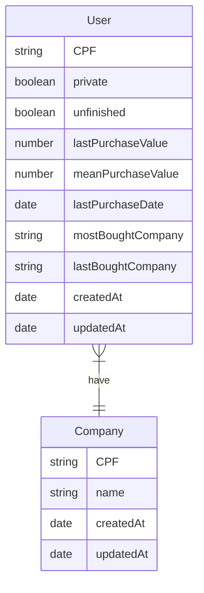

# Docker Challenge

> This challenge aims to create an containerized database with docker-compose.

## About

This challenge was made to put to test my coding skills, during this project I worked with start to end with some awesome technologies like TypeORM, Node, Docker and others.

#### Objectives

- [x] Create an Typescript/Javascript service
- [x] Clean given data (Obs.: the file does not have a common separator)
- [x] Validate Brazilian documents(CPF and CNPJ)
- [x] Make this data persist on a database(PostgresSQL)
- [x] Componentize services to Docker
- [x] Create a simplified version of docker to Docker compose(through yml file)

### The Data

In the seed folder you can find the origin data, labeled as "base_teste" and the cleaned data, named "cleanedSeed". The process of getting dirty data and clean it to an easily more readable state is key to data science, that's why it was the first thing that you need to do.

> This cleaning process is called [Data pre-processing](https://en.wikipedia.org/wiki/Data_pre-processing)

I started with retrieving all data in a data stream stored in a variable, after that I splitted all this long string into lines. In the first line, where is stored the table names, I normalized and removed any "letter tones", and then removed spaces.
To complete it, I got every word of every line and joined with commas to store it in a .csv file.

### The Database

As the objectives suggest, I used postgres database in this project. Creation and handling of the data was made with [TypeORM](https://typeorm.io/#/) , an Orm library for typescript and javascript.
With Typeorm I created 2 entities(tables), User and Company, where user would store the bulk of the data and the company would serve as an complement.



As you can see, it's a very simple relationship were in the lastBoughtCompany and mostBoughtCompany the user can relate to a company, therefore the company can have many users but they can only store one value of it.
To feed data to the database I first used typeorm's generation code, that gets my entities and creates an SQL query automatically.
**Warning**: Do not rely on this generated code, always review the queries, it can(and will) break your database if you're not careful.

## Getting Started

These instructions will get you a copy of the full project up and running on your local machine for development and testing purposes.

The project will be build on node.js, and I used npm for managing packages, but you can feel free to use yarn.

- **Npm** is distributed with Node.js which means that when you download Node.js, you automatically get npm installed on your computer. [Download Node.js](https://nodejs.org/en/download/)
- **Yarn** is a package manager built by Facebook Team and seems to be faster than npm in general. [Download Yarn](https://yarnpkg.com/en/docs/install)

## Setting up Databases and Services

The project uses [PostgreSQL](https://www.postgresql.org) for the database( but you can use other DB as you wish )

In this project, you'll need [Docker](https://www.docker.com) to install and run the databases and services above. For simplification purposes, you'll also need docker-compose, which can be installed following: [Docker Compose Install](https://docs.docker.com/compose/install/)

## How to Install

With node and docker installed, you first need to get the project:

```
 1. git clone https://github.com/Orine7/nwc.git
 2. cd nwc
```

After that execute the docker compose yml:

    docker-compose up -d

This will create your postgres server, and then populate it.

## Checking if it worked

To get a sense if this simple instructions actually worked you can do one of two things(or both of them if you want to be sure):

1.  Check your database
    Go to your preferable DB viewer( I use [DBeaver](https://dbeaver.io/) ) and create a new connection. If you looked into the code, you found the connection options in the .yml file. But if you didn't find anything you can try to use the standard connection option as the docker is exposing 5432 port.

    > Standard connection options is as it follows:
    > Password: 15061007
    > User: postgres
    > Database: nwc_db
    > Host: localhost

2.  Check the Container
    In your terminal, run:

            docker-compose logs nwc

        If everything has runned correctly, you should see an "Done!" log at the end.
